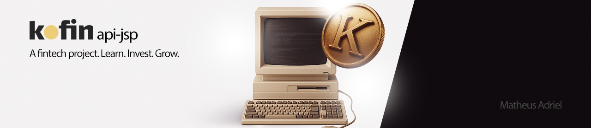
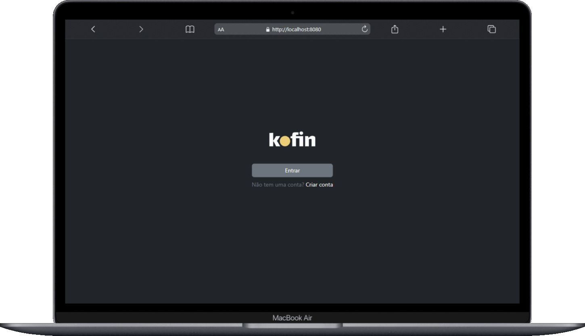

<h1>kofin-api-jsp</h1>

 <strong>Kofin</strong> is a <strong>fintech platform that integrates financial management with a focus on education</strong>. The project involves the development of a <strong>RESTful API in Java</strong>, applying <strong>Object-Oriented Programming (OOP)</strong> principles and a <strong>layered architecture</strong>, integrated with an <strong>Oracle database</strong>. It includes the creation of logical and relational models, as well as UML diagramming. Finally, the graphical interface was designed in Figma and developed using Bootstrap 5, HTML, CSS, and JavaScript.

## Built with

## Sections

 

- [x] **Authentication**

  - [ ] Login
  - [ ] Register
  - [ ] Logout

- [x] **Financial Management**
  - [ ] Dashboard
  - [ ] Transactions
    - [ ] Create
    - [ ] Update
    - [ ] Delete
  - [ ] Cards
    - [ ] Create
    - [ ] Update
    - [ ] Delete

- [x] **User**
  - [ ] Profile

 

## Contributing

If you have a suggestion that would make this better, please fork the repo and create a pull request.

1. Fork the Project
2. Create your Feature Branch (`git checkout -b feature/newFeature`)
3. Commit your Changes (`git commit -m 'Add some cool things'`)
4. Push to the Branch (`git push origin feature/newFeature`)
5. Open a Pull Request

(<a href="#readme-top">^</a>)

## Contact

